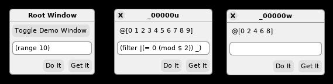

# General-Purpose Graphical [Janet](https://janet-lang.org/) REPL

Janet REPL in the image of Self and gtoolkit.

  
[Demo Video](https://www.1a-insec.net/blog/20-janet-graphical-repl/)

I'll try to make this a much better REPL than the terminal one (`janet`).

This program is developed together with [dvui](https://github.com/david-vanderson/dvui).

## Building

To run the program, run `zig build run` with Zig 0.11.0.

## How it works

Knowledge of Janet is required.

- Write code in the text field.
- "Do It" executes the code in text field.
- "Get It" executes the code and give the result a name.
- Pressing Enter at the end of text field = "Get It".
- Each top-level definition (`def`, `var`) that starts with `_` will be a window. `_` is a special variable that represents current object/window (when writing code in the text field).
- The window shows object representation live.

## To do

- [x] unique `def` for each window/object (all starts with `_`)
- [x] closable windows (delete variable on close)
- [x] "Do it" and "Get it"
- [x] unclosable root window with demo window toggle
- [ ] Define view protocol (like `{_ :dview}`)
- [ ] different view tabs (like in gtoolkit)
- [ ] "broadcast variable name" button (via subscription system in Janet)
- [ ] persist env to file
<!-- - [ ] show stdout/stderr in window somehow -->
- [ ] clean up
